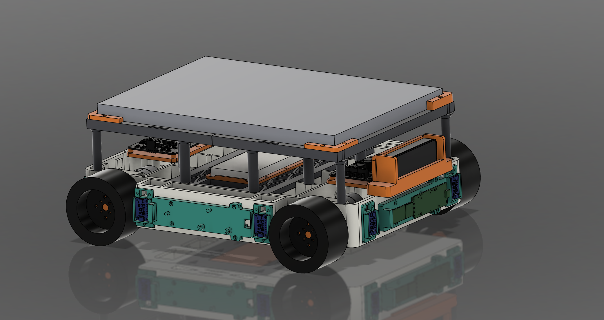

# Mini Tesla — Autonomous Electric Robot Platform

> **A miniature autonomous electric vehicle built to explore perception, navigation, rapid obstacle response, and regenerative braking.**

  

## Members

**Daksh Gupta** — Computer Engineering, Virginia Tech  
Project Lead / Robotics & Embedded Systems  
mailtodaksh@vt.edu

## Mentor

**Virginia Tech AMP Lab**

## Current Status

🚧 **In Progress — Mechanical CAD & Chassis Development**

The current focus is completing the physical platform: chassis, motor mounting, wheel integration, sensor placement, electronics packaging, and preparation for the first assembled prototype.

---

## Project Overview

**Mini Tesla** is a custom four-wheel robotic EV platform designed to combine autonomous robotics with an experimental regenerative-braking drivetrain.

The robot is being built to:

- navigate autonomously using **ROS 2**
- localize using **stereo vision, wheel odometry, and IMU data**
- detect nearby obstacles using **stereo depth, ToF sensors, and radar**
- react rapidly to unexpected objects in its path
- perform higher-level **object and person detection**
- measure energy recovered during **regenerative braking**
- operate in both **manual and autonomous modes**
- validate algorithms in **Gazebo and NVIDIA Isaac Sim**

The long-term goal is a fully integrated autonomous vehicle that can perceive, decide, move, stop safely, and provide real experimental data about its braking and energy-recovery performance.

---

## Educational Value Added

Mini Tesla brings several areas of engineering together in one physical platform:

**Mechanical Design** — Modular chassis design, drivetrain integration, sensor mounting, structural design, and additive manufacturing.

**Embedded Systems & Controls** — Motor control, encoder feedback, real-time control, sensor interfaces, and communication between the low-level controller and autonomy computer.

**Autonomous Robotics** — ROS 2, localization, SLAM/VSLAM, path planning, sensor fusion, and autonomous navigation.

**Computer Vision & Perception** — Stereo depth, object detection, obstacle detection, and environmental understanding.

**Power Electronics** — Motor driving, braking behavior, electrical power measurement, and regenerative-energy experiments.

**Simulation** — Testing robot behavior in Gazebo and NVIDIA Isaac Sim before deploying changes to hardware.

---

## Current Tasks

- [ ] Complete full mechanical CAD assembly
- [ ] Finalize modular chassis and drivetrain mounting
- [ ] Finalize camera, ToF, radar, and electronics placement
- [ ] Print and assemble the first complete chassis prototype
- [ ] Integrate motors, encoders, motor drivers, and Teensy 4.1
- [ ] Bring up low-level motion control
- [ ] Integrate the perception sensors
- [ ] Implement localization and autonomous navigation
- [ ] Develop rapid obstacle-response behavior
- [ ] Test and measure regenerative braking
- [ ] Build the final integrated autonomous demonstration

---

## Key Design Decisions

**Mecanum Drivetrain**  
The robot uses four independently driven mecanum wheels with **Pololu 37D 20:1 gearmotors with encoders**, allowing forward, lateral, diagonal, and rotational motion while retaining encoder feedback for closed-loop control and odometry.

**Regenerative Braking**  
Regenerative braking is one of the project's main experiments. The drivetrain and power electronics are being designed so braking events can be measured for recovered voltage, current, energy, stopping distance, and response time.

**Laptop-Based Compute**  
A sufficiently capable laptop is used as the primary onboard compute platform for ROS 2, perception, navigation, and higher-level autonomy. The design is not tied to a specific laptop model.

**Teensy 4.1 Low-Level Controller**  
The Teensy handles time-sensitive motor, encoder, and actuator control while the laptop handles higher-level autonomy.

**Multi-Sensor Perception**  
The perception stack combines an **OAK-D Lite**, close-range **Time-of-Flight sensors**, an **IMU**, wheel encoders, and a forward-facing **TI mmWave radar**. Each sensor covers a different part of the perception problem instead of relying on a single sensor.

**Modular Chassis**  
The chassis is designed as a serviceable, multi-part 3D-printed structure with removable motor and sensor modules. Early prototypes use PLA, with stronger engineering filament planned for later revisions.

---

## BOM + Major Components

| Component | Role | Qty |
|---|---|---:|
| Pololu 37D 20:1 Gearmotor + Encoder | Drivetrain | 4 |
| Cytron Dual-Channel Motor Driver | Motor Control | 2 |
| Teensy 4.1 | Low-Level Control | 1 |
| OAK-D Lite | Stereo Vision / Depth | 1 |
| Time-of-Flight Sensors | Close-Range Obstacle Detection | 8 |
| TI IWR6843AOPEVM | Forward mmWave Radar | 1 |
| IMU | Motion Estimation | 1 |
| Battery + Power Electronics | Power System | 1 set |
| Custom 3D-Printed Chassis | Structure | 1 |

**Project budget target:** approximately **$1,700** for the complete platform.

---

## Timeline

### Milestone 1 — Physical Platform
**Current focus**

Complete the chassis, motor mounts, wheel integration, sensor mounts, electronics layout, and physical prototype assembly.

### Milestone 2 — Drive & Sensor Integration

Bring up the drivetrain, encoders, Teensy control, sensor interfaces, manual driving, odometry, and initial regenerative-braking tests.

### Milestone 3 — Autonomous Vehicle

Integrate localization, perception, navigation, obstacle response, regenerative-braking experiments, simulation, and the final autonomous demonstration.

---

## Software & Tools

| Area | Technologies |
|---|---|
| Robotics | ROS 2 Jazzy, Nav2 |
| Simulation | Gazebo Harmonic, NVIDIA Isaac Sim |
| Vision | OAK-D / DepthAI, OpenCV |
| Embedded | Teensy 4.1, C/C++ |
| Autonomy | SLAM, VSLAM, Sensor Fusion, Path Planning |
| Mechanical Design | Fusion 360 / SolidWorks |
| Development | Python, C++, Linux, Git/GitHub |

---

## Useful Links

- [Project Portfolio](https://advanceuser2005.github.io/)
- [GitHub Profile](https://github.com/AdvanceUser2005)
- [ROS 2 Documentation](https://docs.ros.org/)
- [Nav2 Documentation](https://docs.nav2.org/)
- [NVIDIA Isaac Sim](https://developer.nvidia.com/isaac-sim)
- [DepthAI / OAK Documentation](https://docs.luxonis.com/)
- [Teensy 4.1](https://www.pjrc.com/store/teensy41.html)

---

## Project Log

### October 2026

- Current Mini Tesla architecture finalized around a four-wheel mecanum autonomous EV platform.
- Mechanical CAD is being redesigned around the actual purchased components and their supplied geometry.
- Chassis architecture moved toward a modular, multi-part printed design for easier manufacturing and service.
- Separate removable motor mounts selected instead of integrating the motors directly into the chassis.
- OAK-D Lite, ToF sensors, IMU, wheel encoders, and mmWave radar selected for the perception stack.
- Laptop-based onboard compute selected for the current autonomy stack.
- Teensy 4.1 selected for low-level real-time control.
- Regenerative braking remains a core experimental objective of the platform.
- Current priority: **finish the complete mechanical assembly and move into physical integration.**

---

> **Mini Tesla is an active development project.** Capabilities described above represent the intended platform and are being implemented progressively as each subsystem is completed.
