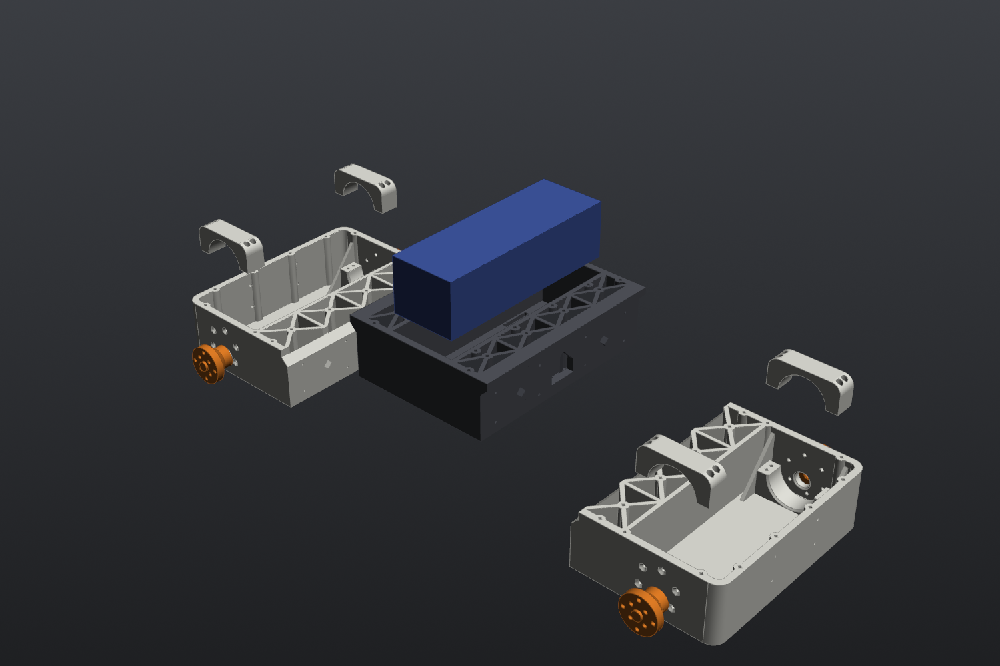

# 10C4I chassis v2

A 3D-printed, 3-section mecanum chassis built around the real parts: Pololu 37D 19:1 gearmotors, REV DUO 75 mm mecanum wheels, and a Turnigy 6S 5200 mAh pack. It carries a Jetson Orin Nano Super and the Velodyne Puck LITE on top.

| Assembled | Exploded |
|---|---|
|  |  |

## Key dimensions

| | mm |
|---|---|
| Body length × width × height | 356 × 170 × 49 |
| Width over wheels | ~258 |
| Wheelbase / track (wheel centres) | 266 / 217 |
| Ground clearance (floor underside) | 21 |
| Top face above ground | 70 |
| Section length (all three identical) | 118.7 (+6 mm lap lip on each end of the center) |

The footprint is sized to roughly a 16" MacBook Pro. 170 mm is the narrowest body the battery fits across.

**Coordinates** (script, STEP and the mount-point CSV): X forward, Y left, Z up. Z = 0 is the chassis underside, origin at the robot's centre.

## Parts

| Part | Qty | Print size (mm) | Solid volume | Page |
|---|---|---|---|---|
| Center section | 1 | 130.7 × 170 × 49 | 393 cm³ | [center_section.md](parts/center_section.md) |
| End section (front = rear) | 2 | 118.7 × 170 × 49 | 299 cm³ | [end_section.md](parts/end_section.md) |
| Motor cap | 4 | 56 × 16 × 22.8 | 10.6 cm³ | [motor_cap.md](parts/motor_cap.md) |
| Wheel adapter | 4 | Ø31 × 21.7 | 8.8 cm³ | [wheel_adapter.md](parts/wheel_adapter.md) |
| Tolerance coupon | 1 | 104 × 70.5 × 34 | 60 cm³ | [tolerance_coupon.md](parts/tolerance_coupon.md) |

Every part fits the Prusa MK4S bed (250 × 210 × 220) and prints **without supports, in the orientation it's exported in**.

## Design rules

- **Fasteners:** M3 is used *only* at the motor faces, because that's what Pololu tapped. Everything printed-to-printed is **M2.5 into heat-set inserts**.
- **Inserts:** Pofsnnx M2.5 × 4 mm long × 3.5 mm OD. Pilot hole is 3.1 mm (pending coupon). Use the 4 mm-long ones everywhere; all screw lengths assume them.
- **Tolerances:** every clearance is in one block at the top of `src/mini_tesla_10c4i_v2.py`:

| Variable | Value | What |
|---|---|---|
| `INS_M25` | 3.1 | M2.5 insert pilot hole |
| `INS_DEPTH` | 6.0 | blind depth for inserts |
| `CLR_M25_V` / `CLR_M25_H` | 2.9 / 3.0 | M2.5 clearance, hole vertical / horizontal in print |
| `CLR_M3_H` | 3.4 | M3 clearance through the motor walls |
| `CSK_M3_D` | 6.4 | 90° countersink for M3 flat heads |
| `BUSH_D` | 12.3 | gearbox bushing (12.0 nominal) |
| `SLIDE` | 0.25 | per-side clearance on pegs and the lap joint |
| `GB_BORE` | 37.2 | clamp bore over the Ø36.8 gearbox |
| `CLAMP_GAP` | 0.8 | cap sits this high so screws actually clamp |
| `DBORE_D` / `DFLAT` | 6.15 / 2.45 | wheel adapter D-bore |

## Hardware

| Qty | Part | Where |
|---|---|---|
| 24 | M3×8 countersunk (flat head) | motor faces, 6 per motor. Leaves 2.5 mm of thread in the gearbox (Pololu max 3 mm) |
| 16 | M2.5×10 socket head | section joints, 8 per joint |
| 16 | M2.5×16 socket head | motor caps, 4 per cap |
| 32 | M2.5×6 socket head | wheels, 8 per wheel ¹ |
| 4 | M2.5×6 cup-point set screw | wheel adapter onto the shaft flat |
| 68 | M2.5 heat-set inserts (assembly) | 16 joint + 16 clamp + 32 wheel + 4 set-screw |
| up to 56 | M2.5 heat-set inserts (mounting) | 48 top face + 2×2 per bumper, install as needed |
| 2 | 20 mm velcro straps | battery |

¹ The chat's list said 16 (4 per wheel). That was before the adapter went to 8 inserts, so 32 is the updated count. Check the length against the wheel web (2.4 mm) once you have one in hand.

## Printing

- Filament per the BOM: **PA612-CF**. Use a hardened nozzle, dry the spool, and put glue stick on the bed (170 mm wide nylon flats like to curl).
- Roughly 1.1–1.2 kg for the whole chassis.
- **Print the coupon first.** Don't print the big sections until the coupon numbers are in the script.

## Assembly order

1. Heat-set all assembly inserts: joint inserts in the center bulkheads, clamp inserts in the end-section saddles, and 9 per wheel adapter.
2. **Motors (left first on each end):** drop the motor in about 22 mm inboard, then slide it outboard until the gearbox bushing seats in the wall hole. Lift it ~1.5 mm as the gearbox enters the clamp. Fit 6× M3×8 flat heads from outside; they sit flush because the wheel is only 3 mm off the wall. The encoder cable tab is clocked to clear the floor.
3. Motor cap on top of each gearbox with 4× M2.5×16.
4. Wheel adapter onto the D-shaft, set screw on the flat, then the wheel with 8× M2.5×6.
5. Battery into the center bay, two straps through the floor slots.
6. **Join sections:** lower the center section so its lap lips rest on the end bulkheads, with the diamond pegs in their sockets. Then drive 8× M2.5×10 per joint from the end-section side. Motor cables pass through the cable windows.

Install paths and interferences were checked in the model: no part overlaps, the motor face holes match Pololu's STEP within 0.02 mm, and neither motor hits anything on the way in, including the second motor sliding in next to the first.

## Open items

- [ ] Print the coupon and plug the results into the tolerance block (see [tolerance_coupon.md](parts/tolerance_coupon.md))
- [ ] Two corners run bare #4690 motors and need the printed 2-stage gearbox. The current end section only fits the geared #4691. See [bare_motor_gearbox.md](parts/bare_motor_gearbox.md)
- [ ] Print one wheel adapter and test it in a wheel before printing four. The inside of the REV hub cup couldn't be measured
- [ ] Jetson plate, LiDAR mount and D435 bracket: not designed yet. They go on the [mount points](mount_points/)

## Source parts

Real-part data the design is built from:

| Part | Used for |
|---|---|
| Pololu #4691, 37D 19:1 gearmotor + 64 CPR encoder (Pololu STEP) | Gearbox Ø36.8, can Ø34.8, encoder Ø34.0, 6× M3 on a 31 mm circle, 3 mm thread depth, shaft 6 mm D, offset from gearbox centre |
| REV DUO 75 mm mecanum (REV-41-1656/1657, drawing) | Web holes 4× Ø4.0 on 24 mm circle, 4× Ø3.0 on 16 mm circle, Ø8.1 bore, 40.8 wide, web 19.2 inside the wheel |
| Turnigy 6S 5200 mAh | 156 × 54 × 45 envelope, designed for 1 kg |
| Pofsnnx M2.5 inserts | 3.5 mm OD, 4 mm long |
