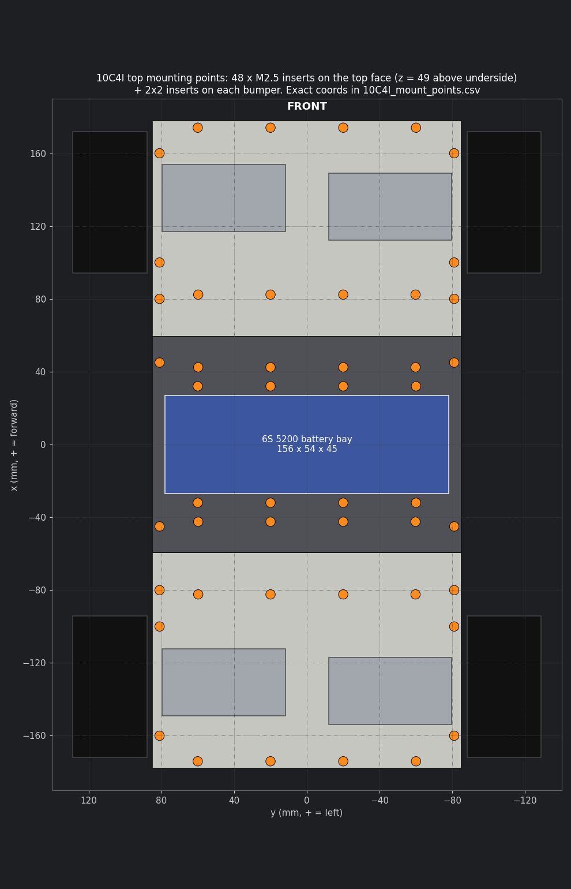

# Mount points

These are the M2.5 heat-set insert positions for anything bolted onto the chassis later: the Jetson plate, the LiDAR mount, the D435 bracket, the Teensy and drivers. Design those brackets in Fusion against `step/10C4I_v2_assembly.step` and snap them to these holes.

- **48 on the top face,** all at z = 49 mm above the chassis underside (70 mm above ground): 20 on the center section and 14 on each end section. The ones around the battery bay are placed so a plate can bridge over the pack.
- **8 on the bumpers:** a 2×2 pattern on each bumper face, at y = ±25 and z = 18 and 38.

`10C4I_mount_points.csv` lists every point with its section, x (forward from robot centre), y (left), z (from the underside) and type. The coordinates match the STEP assembly frame.

Install inserts only where you actually bolt something.
