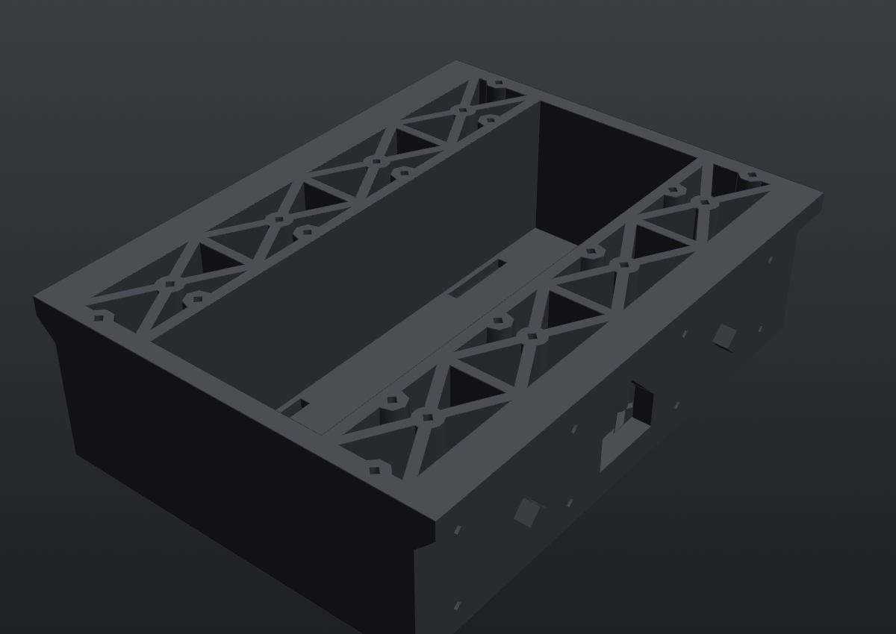

# Center section ×1

**Files:** `step/10C4I_v2_center_section_x1.step`, `stl/10C4I_v2_center_section_x1.stl`. Source is `center_section()` in `src/mini_tesla_10c4i_v2.py`.

**What it does:** the middle third of the chassis. It holds the battery low in a bay and carries the Jetson plate on top. Its lap lips put the center's weight *onto* the end sections instead of hanging it on screws.

| | |
|---|---|
| Print size | 130.7 × 170 × 49 mm (118.7 body + 6 mm lip each end) |
| Orientation | floor on the bed, no supports |
| Walls | floor 3.0, sides 5.5, bulkheads 6.0, ribs 3.0 |

## Features

- **Battery bay:** 56 mm (along X) × full inner width, between two 3.5 mm walls. The 6S pack (156 × 54 × 45) lies crosswise with 1.5 mm to spare lengthwise, so it only goes in one way.
- **Strap slots:** 4 slots, 3.5 × 25 mm, through the floor at x = ±24.5, y = ±45. Two 20 mm velcro straps go around the pack.
- **X-grid strips:** on each side of the bay, 4 X-braced cells (Y breaks at ±40 and 0) with triangular floor windows. This is the cross-grid look from the reference photo, and it also acts as the bending structure.
- **Lap lips:** a 6 mm lip at the top of each end overhangs onto the end section's bulkhead. The underside is 45°, so it prints without support.
- **Diamond pegs:** 2 per end (y = ±45, z = 20, 4 mm "radius", 5 mm long) for alignment and shear.
- **Joint inserts:** 8 horizontal M2.5 inserts per bulkhead at y = ±25 and ±70, z = 8 and 32. The screws come in from the end-section side.
- **Cable window:** a pentagon through each bulkhead (24 mm wide, z = 9 to 32) for motor and encoder cables.
- **Top mount points:** 20 full-height Ø8 columns with M2.5 inserts at the top face (z = 49):
  - 8 on the X-grid nodes
  - 8 along the bay edges (x = ±32, y = ±20 and ±60), so a plate can bridge over the pack
  - 4 on the side walls at x = ±45 (kept clear of the bay)

Exact coordinates are in [`../mount_points/10C4I_mount_points.csv`](../mount_points/10C4I_mount_points.csv).

## Hardware on this part

- 16× M2.5 inserts (joints)
- up to 20× M2.5 inserts (top mounts, as needed)
- 2× velcro straps
