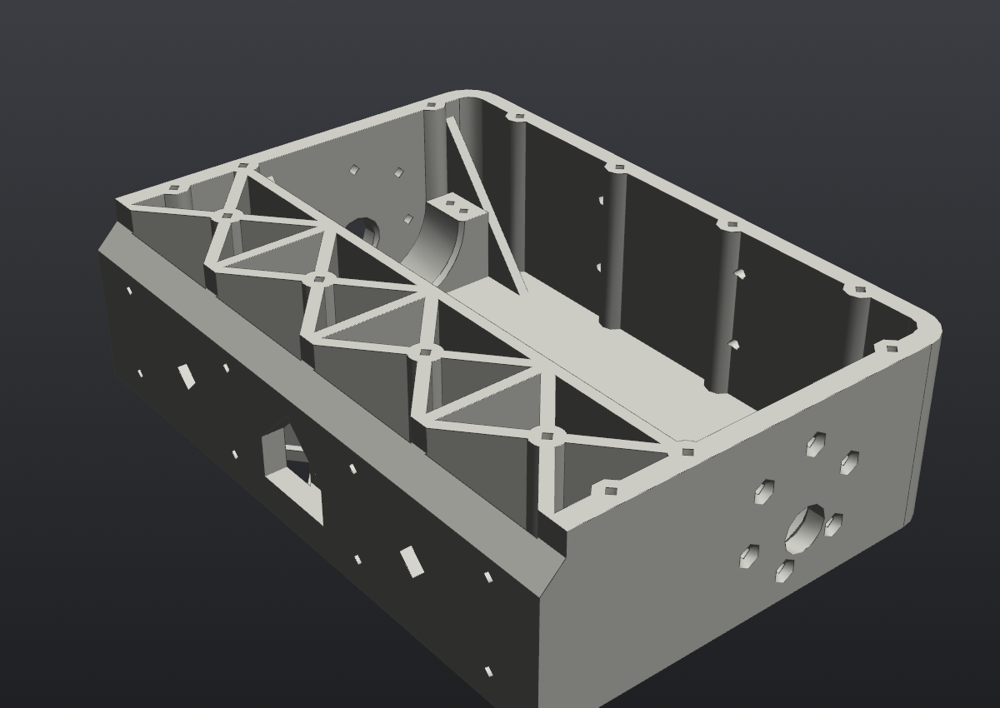
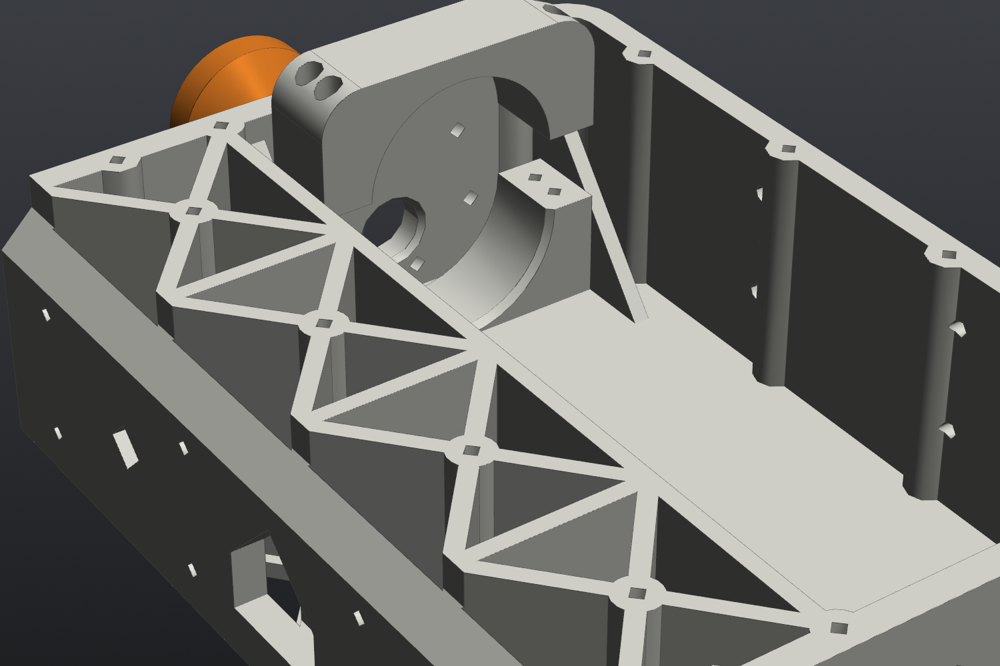

# End section ×2 (front and rear are the same part)

**Files:** `step/10C4I_v2_end_section_x2.step`, `stl/10C4I_v2_end_section_x2.stl`. Source is `end_section()`. The rear is the same part rotated 180°.

**What it does:** holds two motors each, carries the wheels, and forms the bumpers.

| | |
|---|---|
| Print size | 118.7 × 170 × 49 mm |
| Orientation | floor on the bed, no supports |
| Walls | floor 3.0, sides 5.5, joint bulkhead 6.0, bumper wall 5.0, R10 outer corners at the bumper |

In the part's own frame, x = 0 is the joint face and x = 118.7 is the bumper face.

## Motor mount (×2 per part)

- **Axle** at x = 73.7, z = 16.5 above the underside. That gives 21 mm ground clearance on 75 mm wheels.
- **Wall face:** a Ø12.3 hole for the gearbox bushing with a lead-in chamfer inside, plus 6× Ø3.4 holes for M3 on Pololu's 31 mm circle, countersunk (Ø6.4, 90°) from outside so the flat heads sit flush.
- **Clocking:** the gearbox centre sits 2.39 mm along X and 6.58 mm above the shaft. The motor is rotated so the encoder cable tab clears the floor. Face holes were checked against Pololu's STEP: within 0.02 mm.
- **Clamp saddle:** a Ø37.2 half-bore that grips the **gearbox** (Ø36.8), 3 to 19 mm in from the face. 4 vertical M2.5 inserts per saddle for the [motor cap](motor_cap.md).
  - It clamps the gearbox, not the can, on purpose: the can (Ø34.8) and encoder (Ø34.0) pass through the bore, so the motor can drop in ~22 mm inboard and slide out into place.
  - There's also a lead-in chamfer on the inboard end of the bore.
- **Gussets:** 3 mm triangles on both sides of each saddle tie the side wall to the floor.
- There's no centre rib between the two motors, because it would sit in their install path.

## Joint side

- **45° notch** that the center section's lap lip rests in (0.25 mm clearance)
- **2 diamond peg sockets** (0.25 mm clearance)
- **8× Ø3.0 clearance holes** for M2.5×10, driven from inside this section into the center's inserts
- **Cable window**, matching the center section's

## Electronics zone

The zone between the joint bulkhead and a divider at x = 40 has an X-grid with 4 cells and floor windows, like the center section.

## Mount points

- **Top face:** 14 M2.5 inserts on full-height Ø8 columns: 4 X-grid nodes, 6 on the side walls (none above the gearboxes), and 4 along the bumper
- **Bumper face:** a 2×2 pattern of horizontal M2.5 inserts at y = ±25, z = 18 and 38, for the D435 or another front sensor bracket

## Hardware on this part (each)

- 8× M2.5 inserts (clamp saddles)
- up to 18× M2.5 inserts (mounts)
- 12× M3×8 countersunk (motor faces)
- 8× M2.5×10 (joint)

> **Heads-up:** this part only fits the geared #4691. Two corners are getting bare #4690 motors with a printed gearbox, so one end section will need a new variant. See [bare_motor_gearbox.md](bare_motor_gearbox.md).
