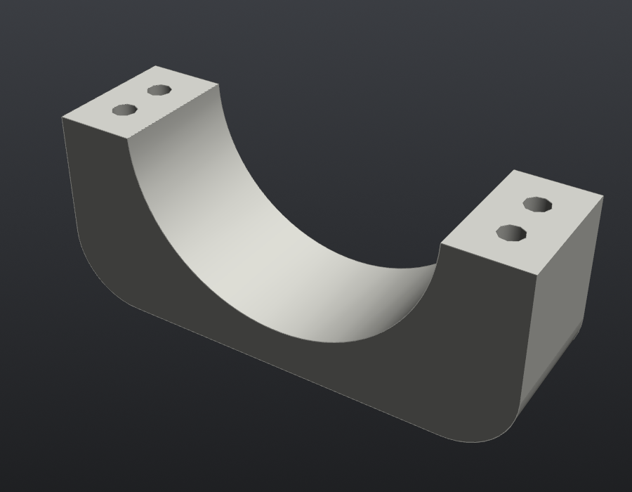

# Motor cap ×4

**Files:** `step/10C4I_v2_motor_cap_x4.step`, `stl/10C4I_v2_motor_cap_x4.stl`. Source is `motor_cap()`.

**What it does:** the top half of the gearbox clamp. With the M3 face screws, it turns the wheel's bending load into a force couple, so the motor isn't cantilevered off six small screws. Don't skip it.

| | |
|---|---|
| Print size | 56 × 16 × 22.8 mm |
| Orientation | flat top on the bed (exported that way) |
| Bore | Ø37.2 over the Ø36.8 gearbox |
| Clamp gap | 0.8 mm. The cap sits this high so the screws actually squeeze the gearbox |

## Features

- 4× Ø2.9 clearance holes for M2.5, at ±23.3 mm from the gearbox centre, 8 and 14 mm in from the motor face
- Ø5.0 counterbores so the screw heads sit below the top
- R8 fillets on the top edges

The same part works for all four corners.

## Hardware (each)

- 4× M2.5×16 socket head into the saddle inserts in the end section
