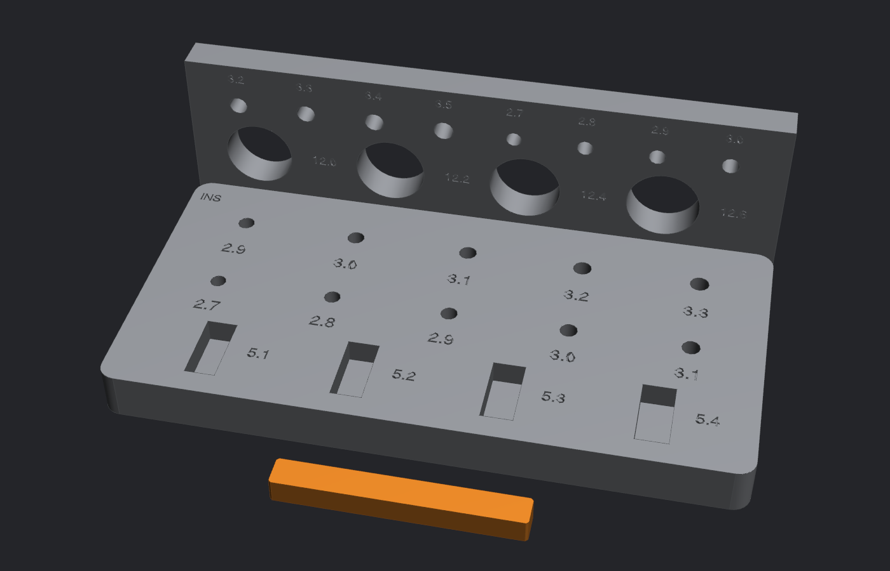

# Tolerance coupon ×1 (print this first)

**Files:** `step/10C4I_tolerance_coupon.step`, `stl/10C4I_tolerance_coupon.stl`. Source is `src/tolerance_coupon.py`.

**What it does:** every printer makes holes a little differently. This coupon finds the real numbers for *your* printer and filament before you spend a kilo of PA612-CF on the chassis. Print it with the **same filament and settings** as the chassis.

| | |
|---|---|
| Size | 104 × 70.5 × 34 mm (plate + standing wall + loose key bar) |
| Orientation | as exported. The wall prints its holes sideways, the same way the motor walls do |

## What it tests

| Row | Sizes (mm) | Feeds script variable |
|---|---|---|
| Plate: M2.5 insert holes (blind 6.5 mm) | 2.9 / 3.0 / 3.1 / 3.2 / 3.3 | `INS_M25` (**most important**) |
| Plate: M2.5 clearance, vertical | 2.7 / 2.8 / 2.9 / 3.0 / 3.1 | `CLR_M25_V` |
| Plate: slots for the 5.00 mm key | 5.1 / 5.2 / 5.3 / 5.4 | `SLIDE` |
| Wall: gearbox bushing | 12.0 / 12.2 / 12.4 / 12.6 | `BUSH_D` |
| Wall: M3 clearance, horizontal | 3.2 / 3.3 / 3.4 / 3.5 | `CLR_M3_H` |
| Wall: M2.5 clearance, horizontal | 2.7 / 2.8 / 2.9 / 3.0 | `CLR_M25_H` |

## How to read it

1. **Insert row:** heat-press one insert into each hole. The winner goes in with light pressure from the iron, ends up flush and straight, and doesn't spin when you tighten a screw into it.
2. **Screw rows:** pick the smallest hole the screw slides through cleanly.
3. **Bushing:** pick the one the gearbox bushing slips into without slop.
4. **Slots:** pick the slot the key slides in with no wobble.

Then update the variables in `src/mini_tesla_10c4i_v2.py`, re-run it, and every hole on the robot updates.

## Results

| Test | Best size | Date |
|---|---|---|
| Insert | _not tested yet_ | |
| M2.5 vertical | _not tested yet_ | |
| M2.5 horizontal | _not tested yet_ | |
| M3 horizontal | _not tested yet_ | |
| Bushing | _not tested yet_ | |
| Key slot | _not tested yet_ | |

## History

The first coupon's insert row ran 3.4 to 4.2 mm, sized for the common ~4 mm-OD inserts. It was re-cut to 2.9 to 3.3 once the actual inserts turned out to be 3.5 mm OD. If you printed a coupon before that, reprint it.
