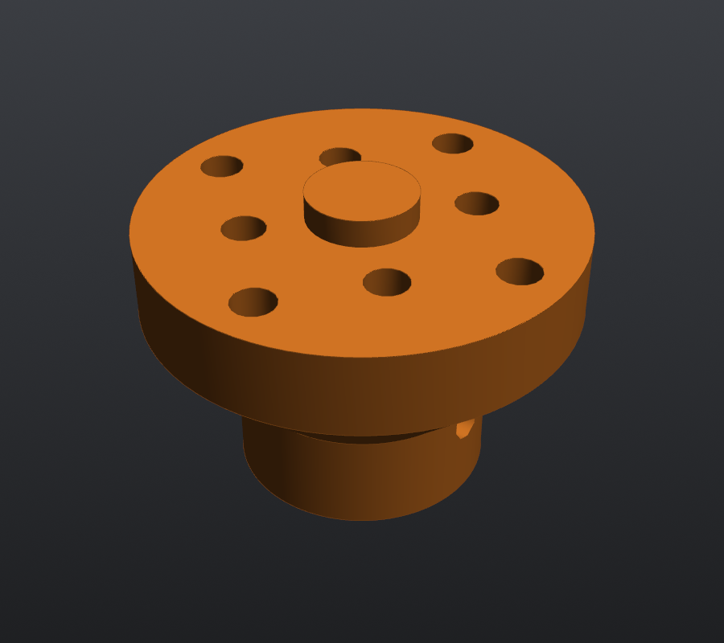

# Wheel adapter ×4

**Files:** `step/10C4I_v2_wheel_adapter_x4.step`, `stl/10C4I_v2_wheel_adapter_x4.stl`. Source is `wheel_adapter()`.

**What it does:** connects the Pololu 6 mm D-shaft to a REV DUO 75 mm mecanum wheel. REV ships 5 mm hex adapters, which don't fit a D-shaft, so this replaces them.

| | |
|---|---|
| Print size | Ø31 × 21.7 mm |
| Orientation | hub end on the bed (exported that way) |
| Position | starts 8.0 mm from the gearbox face (2.5 mm off the wall); the wheel-side face is at 27.7 mm |

## Features

- **Hub:** Ø18, then a 45° cone into a Ø31 × 6 mm flange, so it prints with no overhang.
- **D-bore:** Ø6.15 with the flat at 2.45 mm from centre, 14.6 mm deep, with a lead-in chamfer.
- **Set screw:** a radial M2.5 insert, 6 mm up from the hub end, lands on the shaft's flat.
- **Pilot:** a Ø7.8 × 2 mm boss that centres the wheel in its Ø8.1 bore.
- **8× M2.5 inserts** in the flange face, 5.5 mm deep:
  - 4 on the wheel's 24 mm circle (its Ø4.0 holes)
  - 4 on its 16 mm circle (its Ø3.0 holes), rotated 45°

REV's hole pattern was measured from the REV-41-1656 drawing. The 16 mm circle matches REV's published pattern.

## History

The first v2 adapter used 4 printed dowels in the 3.0 mm holes plus 4 screws. It was changed to 8 inserts for a more secure, repeatable connection.

## Hardware (each)

- 9× M2.5 inserts (8 face + 1 set screw)
- 8× M2.5×6 socket head
- 1× M2.5×6 cup-point set screw

## Watch out

- The D-bore is the part most likely to wear. If a wheel starts slipping, the upgrade is a metal hub.
- **Print one and test-fit it in a wheel first.** The inside of the REV hub cup couldn't be measured from the drawing.
- On the two bare-motor corners, the gearbox output will be a 5 mm hex shaft. Those wheels use REV's own hex adapters, not this part.
