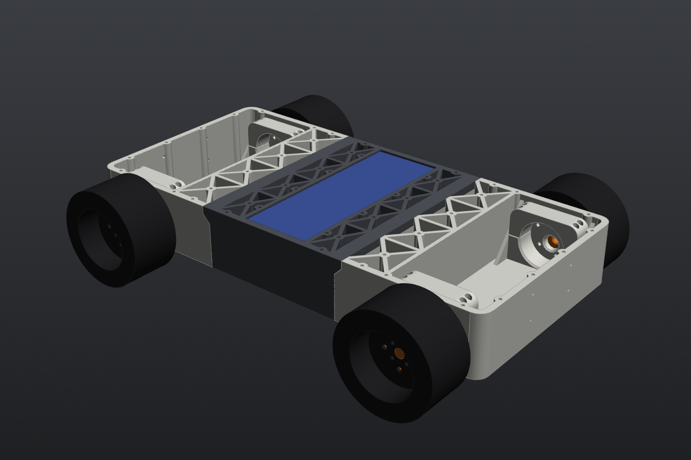

# CAD

All mechanical CAD for Mini Tesla. Right now that means the **10C4I** indoor mecanum prototype. 15C4I (the outdoor gear-changing car) has no CAD in this repo yet.



## What's here

| Item | Status | Doc | Files |
|---|---|---|---|
| 10C4I chassis v2 (overview, assembly, hardware) | Designed, **not printed yet**: waiting on coupon results | [10C4I/README.md](10C4I/README.md) | `10C4I/step/10C4I_v2_assembly.step` |
| Center section ×1 | Designed | [parts/center_section.md](10C4I/parts/center_section.md) | `10C4I_v2_center_section_x1.{step,stl}` |
| End section ×2 (front = rear) | Designed | [parts/end_section.md](10C4I/parts/end_section.md) | `10C4I_v2_end_section_x2.{step,stl}` |
| Motor cap ×4 | Designed | [parts/motor_cap.md](10C4I/parts/motor_cap.md) | `10C4I_v2_motor_cap_x4.{step,stl}` |
| Wheel adapter ×4 | Designed | [parts/wheel_adapter.md](10C4I/parts/wheel_adapter.md) | `10C4I_v2_wheel_adapter_x4.{step,stl}` |
| Tolerance coupon | Ready to print, **print this first** | [parts/tolerance_coupon.md](10C4I/parts/tolerance_coupon.md) | `10C4I_tolerance_coupon.{step,stl}` |
| Top mount-point map (56 M2.5 inserts) | Done | [mount_points/](10C4I/mount_points/) | `.csv` + `.png` |
| Bare-motor 2-stage gearbox ×2 | **Not modeled yet**: needs pinion measurements | [parts/bare_motor_gearbox.md](10C4I/parts/bare_motor_gearbox.md) | none |
| Chassis v1 | Superseded by v2, files not kept | [parts/v1_chassis.md](10C4I/parts/v1_chassis.md) | none |

## Layout

```
cad/10C4I/
├── README.md        overall chassis: dimensions, hardware, print + assembly
├── src/             CadQuery source (the real source of truth)
├── step/            STEP per part + assembly (open these in Fusion)
├── stl/             print-ready STLs, already in print orientation
├── mount_points/    coordinates of every mounting insert
├── images/          renders used in these docs
└── parts/           one page per part
```

## How the CAD is made

The 10C4I parts are **code, not Fusion files**. They're written in [CadQuery](https://cadquery.readthedocs.io/) (Python). Every dimension lives as a variable at the top of `src/mini_tesla_10c4i_v2.py`, so a fit change is one number and a re-run:

```bash
pip install cadquery shapely
cd cad/10C4I/src
OUT_DIR=out python mini_tesla_10c4i_v2.py      # -> STEP + STL per part + assembly
OUT_DIR=out python tolerance_coupon.py
```

The script also pulls in Pololu's motor model as a reference body. To include it, put `37d-gearmotor-19-30-encoder.step` from Pololu's #4691 page next to the script, or point `MOTOR_STEP` at it. The committed assembly STEP is exported **without** the motor and wheel reference bodies (~5 MB instead of ~27 MB). It has every printed part plus `REF_battery_6S_5200`, so the `REF_motor_*` and `REF_wheel_*` bodies you see in Fusion aren't in it.

> **Edits made in Fusion don't flow back into the script.** Change fits and dimensions in the script. Use Fusion for *new* brackets designed against the STEP.
